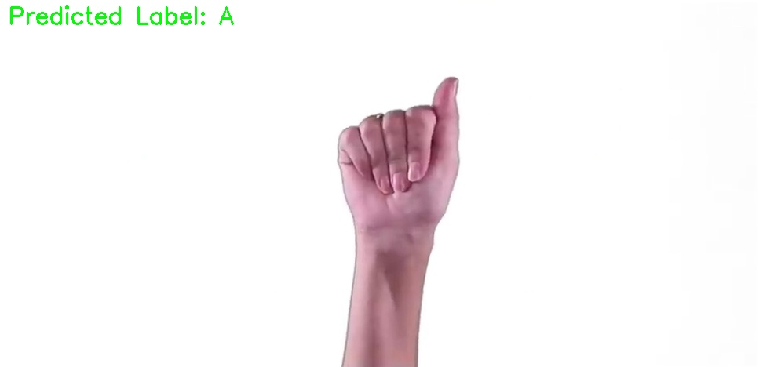
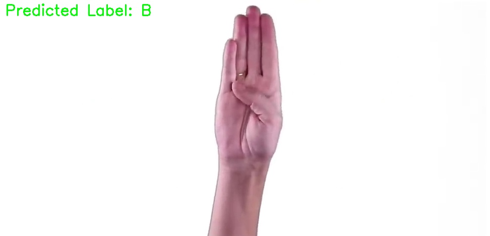
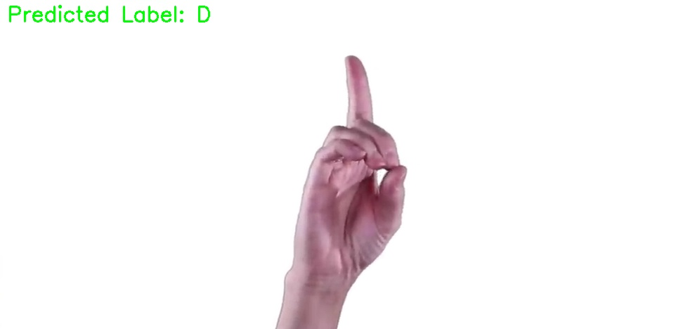
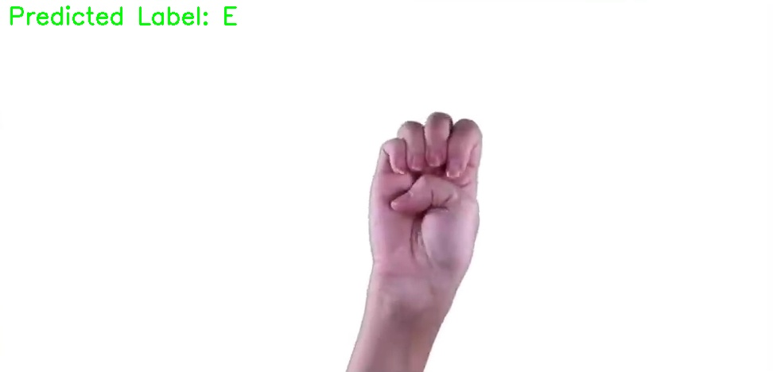
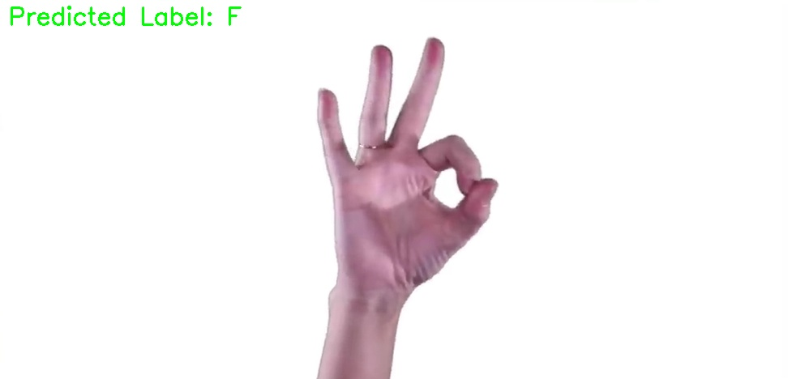
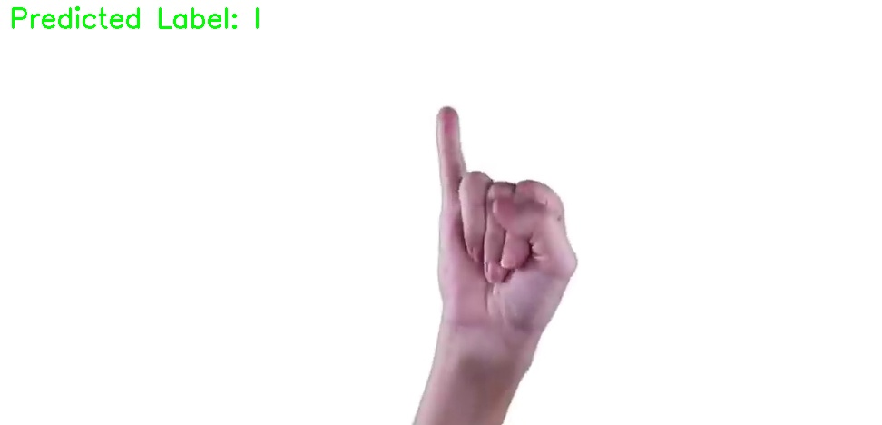
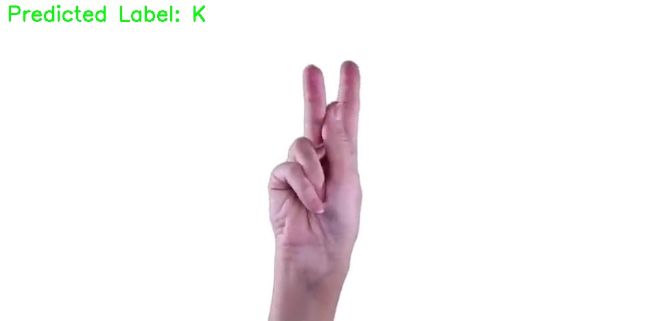

# Sign Language Detection using MediaPipe and SVM

## 📥 Installation:

### Install [uv](https://docs.astral.sh/uv/getting-started/installation/) for linux:
```
curl -LsSf https://astral.sh/uv/install.sh | sh
```

### Clone the repository:
```
git clone https://github.com/ashuguptahere/sign-language-detection.git
cd sign-language-detection
```

### Download dataset from [kaggle](https://www.kaggle.com/grassknoted/asl-alphabet) using cURL and unzip it:
```
curl -L -o archive.zip https://www.kaggle.com/api/v1/datasets/download/grassknoted/asl-alphabet
unzip archive.zip
```

### Install all `uv` dependencies:
```
uv sync
```

### To extract keypoints from data:
```
uv run scripts/extract_keypoints.py
```

### To train the SVM model:
```
uv run scripts/train.py
```

### To test the SVM model on a video:
```
uv run scripts/test.py
```

## 📊 Results:








## 🤝 Contributing:

Contributions are welcome! Please feel free to submit a Pull Request.

1. Fork the project
2. Create your feature branch (`git checkout -b feature/AmazingFeature`)
3. Commit your changes (`git commit -m 'Add some AmazingFeature'`)
4. Push to the branch (`git push origin feature/AmazingFeature`)
5. Open a Pull Request

## 📝 License:

This project is licensed under the MIT License - see the [LICENSE](LICENSE) file for details.

## 🎥 Video Source [[LINK]](https://www.youtube.com/watch?v=6_gXiBe9y9A):
The model was tested on a video sourced from YouTube to evaluate its performance. The video is included for demonstration purposes and that its ownership belongs to the original creator

---
Made with ❤️ by [Aashish Gupta](https://github.com/ashuguptahere)